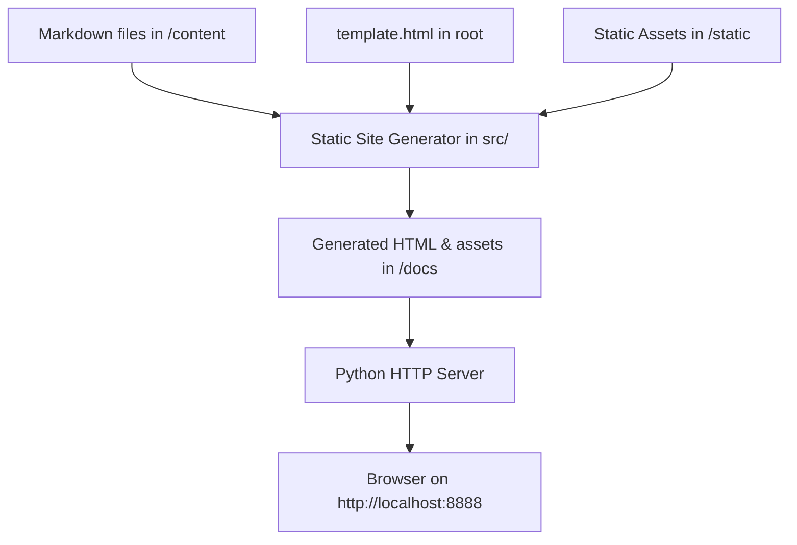

# Motivation for this project
Currently, I am programming more in Python in my spare time and would like to delve deeper into the programming language.

As part of the Boot.dev learning platform, there is a guided project where a static site generator (a clone of Hugo) was built, which helped me achieve my goal. This project focuses on Object-Oriented Programming (OOP) and Functional Programming concepts.

# What is a Static Site Generator (SSG)?
A static site generator takes raw content files (like Markdown and images) and converts them into a static website (a mix of HTML and CSS files). Static sites are very popular for blogs and other content-heavy websites because they're lightning-fast, secure, and extremely easy to host (e.g., via GitHub Pages).

# What have I learned?
- **Project Setup**: Setting up project dependencies and structure, and scripting common actions using shell scripts (`main.sh`, `test.sh`, `build.sh`).
- **Object-Oriented Programming (OOP)**: Building a clean, modular structure with inheritance and encapsulation:
  - Base [HTMLNode](file:///Users/lschloegel/coding/external/boot-dev/build-a-static-site-generator/src/htmlnode.py) class for representing HTML elements.
  - [LeafNode](file:///Users/lschloegel/coding/external/boot-dev/build-a-static-site-generator/src/leafnode.py) for terminal nodes (tags with text, attributes, or self-closing tags).
  - [ParentNode](file:///Users/lschloegel/coding/external/boot-dev/build-a-static-site-generator/src/parentnode.py) for handling nested HTML children recursively.
  - [TextNode](file:///Users/lschloegel/coding/external/boot-dev/build-a-static-site-generator/src/textnode.py) as an intermediate structure for inline elements.
- **Recursion**: Building tree representation of documents and rendering them recursively using `to_html()`.
- **Text Processing & Markdown Parsing**:
  - **Inline parsing**: Extracting images, links, bold (`**`), italic (`*`/`_`), and inline code (`` ` ``) using regex and string manipulation.
  - **Block parsing**: Categorizing markdown blocks into paragraphs, headings, code blocks, blockquotes, ordered lists, and unordered lists.
- **Content Pipeline**: Recursively reading Markdown files from a `/content` directory, injecting content into a `template.html` file, and writing the output to a public directory (`/docs`).
- **Unit Testing**: Writing robust unit tests in Python using the `unittest` framework to verify markdown-to-HTML nodes conversion and edge cases.

# How to Run the Project

1. **Run Unit Tests**:
   Run tests using the shell script:
   ```bash
   ./test.sh
   ```
   Or directly via Python:
   ```bash
   python3 -m unittest discover -s src
   ```

2. **Generate the Site and Start a Local HTTP Server**:
   To compile the markdown files and serve them locally:
   ```bash
   ./main.sh
   ```
   *Note: While the standard curriculum uses the `/public` directory, this project has been configured to compile files into `/docs` (making it ready for GitHub Pages hosting). `main.sh` will serve the site locally.*

3. **Build with Custom Basepath**:
   To generate the production-ready static site with a custom base path (useful when hosting in subfolders):
   ```bash
   ./build.sh
   ```

# Architecture

The flow of data through the system is:



1. **Markdown files** are read from the `/content` directory. A `template.html` file is read from the root of the project.
2. The **static site generator** (the Python code in `src/`) processes the Markdown files, templates, and static assets.
3. The generator converts Markdown to HTML pages and writes them to the `/docs` directory.
4. We start the built-in Python HTTP server to serve the contents of `/docs` on `http://localhost:8888`.
5. We navigate to `http://localhost:8888` in a web browser to view the rendered site.

## How the SSG Works
When the program runs, it executes the following steps:
1. **Clean**: Deletes everything in the `/docs` directory.
2. **Copy Static Assets**: Recursively copies static assets (images, CSS, etc.) from `/static` to the `/docs` directory.
3. **Generate Pages**: Recursively looks for Markdown files in `/content` and for each file:
   1. Opens the file and reads its content.
   2. Extracts the title from the first `# Heading` line.
   3. Splits the Markdown content into blocks (paragraphs, headings, lists, etc.).
   4. Converts the blocks into a tree of [HTMLNode](file:///Users/lschloegel/coding/external/boot-dev/build-a-static-site-generator/src/htmlnode.py) objects.
   5. Converts inline markdown within the blocks to [TextNode](file:///Users/lschloegel/coding/external/boot-dev/build-a-static-site-generator/src/textnode.py) objects and then into child [HTMLNode](file:///Users/lschloegel/coding/external/boot-dev/build-a-static-site-generator/src/htmlnode.py) objects.
   6. Calls the recursive `to_html()` method on the parent node to get a giant HTML string.
   7. Injects the title and HTML string into `template.html`.
   8. Writes the final HTML file to `/docs` preserving the original subdirectory structure.

